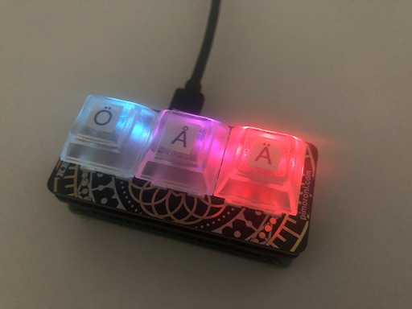

# keybow-sweden
Add-on keyboard with the three missing Swedish characters

Tested on Mac OS X with British English input source.

1. Hardware setup in [Assembling Keybow MINI](https://learn.pimoroni.com/tutorial/sandyj/assembling-keybow-mini)
2. Software setup in [Setting up the Keybow OS](https://learn.pimoroni.com/tutorial/sandyj/setting-up-the-keybow-os), but replace with this repo's `default.lua` file.
3. Go to System Preferences -> Keyboard and Choose "British" under Input Sources
